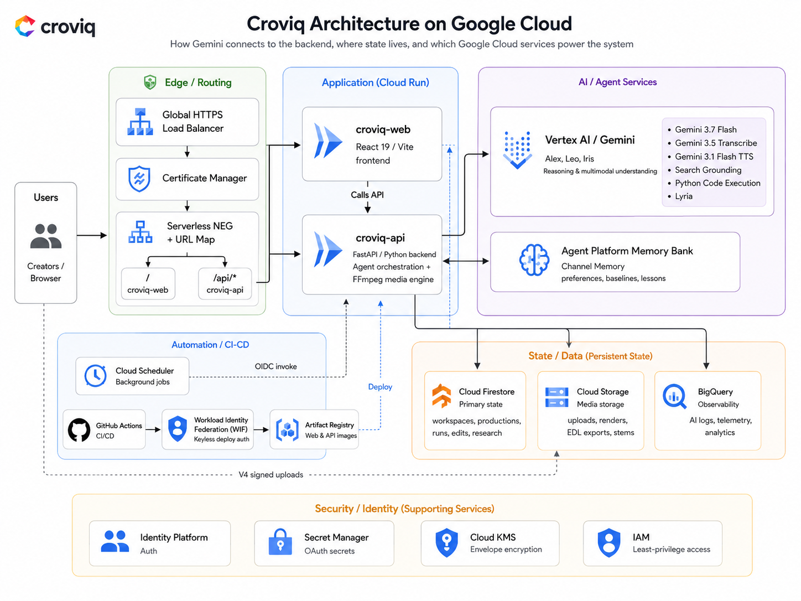

# Croviq



Autonomous multi-agent production studio and channel intelligence platform for YouTube creators. Coordinates specialized AI agents (Alex, Leo, Iris) for dialogue editing, audio mix/voiceover, quality control, and channel performance analysis.

- Production URL: https://app.croviq.app
- Local Web Studio: http://localhost:5173
- Local Backend API: http://localhost:8080
- API Health Check: http://localhost:8080/api/health
- Backend API Docs (Swagger): http://localhost:8080/docs

---

## Prerequisites

| Tool | Version Requirement | Purpose | Verification Command |
| :--- | :--- | :--- | :--- |
| Node.js | `>= 20.0.0` | Frontend runtime | `node -v` |
| pnpm | `>= 9.0.0` | Node package manager | `pnpm -v` |
| Python | `>= 3.12` | Backend runtime | `python3 --version` |
| uv | `>= 0.1.0` | Python package and workspace manager | `uv --version` |
| FFmpeg & FFprobe | In system `$PATH` | Video and audio rendering engine | `ffmpeg -version` |
| Terraform | `>= 1.5.0, < 2.0.0` | Infrastructure as Code | `terraform version` |
| Docker | Latest | Container runtime (optional for local, required for deploy) | `docker --version` |
| Google Cloud SDK | Latest | GCP authentication & management (optional for local) | `gcloud version` |

---

## Local Setup and Spin-Up

Croviq defaults to **Deterministic Local Mode**—agent reasoning, transcription, voiceover synthesis, GCS storage, and Firestore run on deterministic local mocks. No Google Cloud credentials or billing are required.

### 1. Verify Toolchain

Run the environment doctor to ensure all required CLI binaries are installed:

```bash
make doctor
```

### 2. Bootstrap Dependencies and Environment

Bootstrap the repository, copy environment templates, install frontend dependencies, and synchronize Python workspace packages:

```bash
make setup
```

This command automatically:
- Copies `.env.example` -> `.env`
- Copies `apps/web/.env.example` -> `apps/web/.env.local`
- Runs `pnpm install --frozen-lockfile`
- Runs `uv sync` across `packages/domain`, `packages/observability`, `packages/media`, `packages/agents`, and `apps/api`

### 3. Start Development Servers

Start the FastAPI backend and Vite frontend concurrently:

```bash
make dev
```

Servers will be accessible at:
- Frontend: `http://localhost:5173`
- Backend API: `http://localhost:8080`
- API Health: `http://localhost:8080/api/health`
- Swagger Docs: `http://localhost:8080/docs`

To run servers individually:
- Backend only: `make dev-api`
- Frontend only: `make dev-web`

### 4. Sign In (Local Dev)

1. Open `http://localhost:5173`.
2. Sign in with the local development credentials:
   - Email: `demo@croviq.app`
   - Password: any password (or blank)

---

## Local Execution Modes

### Mode 1: Deterministic Local Mode (Default)

Configured in `.env`:
```env
ENVIRONMENT=development
GENAI_BACKEND_PROVIDER=fake
MEDIA_STORAGE_PROVIDER=fake
MEMORY_STORE_PROVIDER=fake
SPEECH_SERVICE_PROVIDER=fake
CROVIQ_ALLOWED_EMAILS=demo@croviq.app
```
Runs entirely offline with zero cloud dependencies.

### Mode 2: Live Google Cloud / Vertex AI Connected Mode

To connect the local application to live Vertex AI (Gemini 3.7 Flash, Gemini 3.5 Transcribe, Gemini 3.1 TTS), Google Cloud Storage, and Google Agent Platform Memory Bank:

1. Authenticate Application Default Credentials (ADC):
```bash
gcloud auth login
gcloud auth application-default login
gcloud config set project YOUR_GCP_PROJECT_ID
gcloud auth application-default set-quota-project YOUR_GCP_PROJECT_ID
```

2. Update `.env`:
```env
GCP_PROJECT_ID=YOUR_GCP_PROJECT_ID
GCP_REGION=us-central1
GENAI_BACKEND_PROVIDER=google
SPEECH_SERVICE_PROVIDER=google
MEDIA_STORAGE_PROVIDER=google
MEMORY_STORE_PROVIDER=google
```

3. Restart the dev servers:
```bash
make dev
```

---

## Docker Compose Spin-Up

To run the full stack inside Docker containers without local Python or Node installations:

```bash
# Build and start web and api containers
docker compose up --build
```

- Frontend: `http://localhost:5173`
- Backend API: `http://localhost:8080`
- Health check: `http://localhost:8080/api/health`

Stop containers:
```bash
docker compose down
```

---

## Verification and Testing

| Command | Scope | Description |
| :--- | :--- | :--- |
| `make verify` | Full Suite | Runs doctor, format check, lint, typecheck, tests, OpenAPI drift check, infra validation, and security scan |
| `make test` | Backend | Runs pytest across all domain packages and API |
| `make e2e` | Frontend | Runs Playwright browser end-to-end tests |
| `make typecheck` | Typing | Runs TypeScript workspace typecheck (`tsc --noEmit`) |
| `make lint` | Quality | Runs Biome linter across frontend codebase |
| `make format` | Formatting | Applies Prettier code formatting |
| `make format-check` | Formatting | Checks Prettier code formatting |
| `make openapi` | Contract | Exports OpenAPI 3.1 schema and regenerates TypeScript client |
| `make infra-validate` | Terraform | Formats and validates all Terraform configurations |
| `make security` | Security | Runs AST security audit, secret scanning, and Gitleaks |

---

## Cloud Deployment (Google Cloud + Cloudflare)

Step-by-step instructions to provision infrastructure, build container images, and deploy Croviq to Google Cloud Run behind a Global Application Load Balancer with Cloudflare DNS.

### Prerequisites

1. Google Cloud Project with billing enabled.
2. `gcloud` CLI authenticated with Project Owner permissions.
3. Terraform CLI (`>= 1.5.0, < 2.0.0`).
4. Cloudflare Account managing the root domain with `CLOUDFLARE_API_TOKEN` (`Zone.DNS` edit permissions).
5. Docker CLI with Buildx.

---

### Step 1: Set GCP Project and Authenticate

```bash
export GCP_PROJECT_ID="your-gcp-project-id"
export GCP_REGION="us-central1"

gcloud auth login
gcloud auth application-default login
gcloud config set project "${GCP_PROJECT_ID}"
gcloud auth application-default set-quota-project "${GCP_PROJECT_ID}"
```

---

### Step 2: Provision Remote State Bucket

Provision the GCS bucket for Terraform remote state:

```bash
cd infra/bootstrap

cp terraform.tfvars.example terraform.tfvars
cat <<EOF > terraform.tfvars
project_id = "${GCP_PROJECT_ID}"
region     = "${GCP_REGION}"
EOF

terraform init
terraform plan -out=tfplan
terraform apply tfplan

cp backend.hcl.example backend.hcl
cat <<EOF > backend.hcl
bucket = "${GCP_PROJECT_ID}-croviq-tfstate"
prefix = "croviq/bootstrap"
EOF

terraform init -migrate-state -backend-config=backend.hcl -force-copy
cd ../..
```

---

### Step 3: Configure Secret Manager Secrets

Store required secrets before deploying the Cloud Run container:

```bash
gcloud services enable secretmanager.googleapis.com --project="${GCP_PROJECT_ID}"

# Create YouTube OAuth Client ID secret
gcloud secrets create youtube-oauth-client-id \
  --project="${GCP_PROJECT_ID}" \
  --replication-policy="automatic" \
  --data-file=- <<< "YOUR_YOUTUBE_OAUTH_CLIENT_ID"

# Create YouTube OAuth Client Secret secret
gcloud secrets create youtube-oauth-client-secret \
  --project="${GCP_PROJECT_ID}" \
  --replication-policy="automatic" \
  --data-file=- <<< "YOUR_YOUTUBE_OAUTH_CLIENT_SECRET"
```

---

### Step 4: Build and Push Container Images

Build production images and push them to Google Artifact Registry to obtain immutable SHA256 digests:

```bash
gcloud services enable artifactregistry.googleapis.com --project="${GCP_PROJECT_ID}"

# Create Artifact Registry repositories
gcloud artifacts repositories create croviq-api \
  --repository-format=docker \
  --location="${GCP_REGION}" \
  --description="Croviq API Docker repository" || true

gcloud artifacts repositories create croviq-web \
  --repository-format=docker \
  --location="${GCP_REGION}" \
  --description="Croviq Web Docker repository" || true

# Authenticate Docker to Artifact Registry
gcloud auth configure-docker "${GCP_REGION}-docker.pkg.dev"

GIT_SHA=$(git rev-parse HEAD)

# Build and push API image
docker build \
  --platform linux/amd64 \
  -f apps/api/Dockerfile \
  -t "${GCP_REGION}-docker.pkg.dev/${GCP_PROJECT_ID}/croviq-api/croviq-api:${GIT_SHA}" \
  -t "${GCP_REGION}-docker.pkg.dev/${GCP_PROJECT_ID}/croviq-api/croviq-api:latest" \
  .

docker push "${GCP_REGION}-docker.pkg.dev/${GCP_PROJECT_ID}/croviq-api/croviq-api:${GIT_SHA}"
docker push "${GCP_REGION}-docker.pkg.dev/${GCP_PROJECT_ID}/croviq-api/croviq-api:latest"

API_DIGEST=$(docker inspect --format='{{index .RepoDigests 0}}' "${GCP_REGION}-docker.pkg.dev/${GCP_PROJECT_ID}/croviq-api/croviq-api:${GIT_SHA}")

# Build and push Web image
docker build \
  --platform linux/amd64 \
  -f apps/web/Dockerfile \
  --build-arg VITE_FIREBASE_API_KEY="YOUR_FIREBASE_API_KEY" \
  --build-arg VITE_FIREBASE_AUTH_DOMAIN="${GCP_PROJECT_ID}.firebaseapp.com" \
  --build-arg VITE_FIREBASE_PROJECT_ID="${GCP_PROJECT_ID}" \
  -t "${GCP_REGION}-docker.pkg.dev/${GCP_PROJECT_ID}/croviq-web/croviq-web:${GIT_SHA}" \
  -t "${GCP_REGION}-docker.pkg.dev/${GCP_PROJECT_ID}/croviq-web/croviq-web:latest" \
  .

docker push "${GCP_REGION}-docker.pkg.dev/${GCP_PROJECT_ID}/croviq-web/croviq-web:${GIT_SHA}"
docker push "${GCP_REGION}-docker.pkg.dev/${GCP_PROJECT_ID}/croviq-web/croviq-web:latest"

WEB_DIGEST=$(docker inspect --format='{{index .RepoDigests 0}}' "${GCP_REGION}-docker.pkg.dev/${GCP_PROJECT_ID}/croviq-web/croviq-web:${GIT_SHA}")
```

---

### Step 5: Deploy Main GCP Infrastructure

Deploy Cloud Run services, Serverless NEGs, Firestore, KMS keys, and the Global Application Load Balancer:

```bash
cd infra

cat <<EOF > backend.hcl
bucket = "${GCP_PROJECT_ID}-croviq-tfstate"
prefix = "croviq/main"
EOF

cat <<EOF > terraform.tfvars
project_id     = "${GCP_PROJECT_ID}"
region         = "${GCP_REGION}"
environment    = "prod"
app_domain     = "app.croviq.app"
root_domain    = "croviq.app"
api_image      = "${API_DIGEST}"
web_image      = "${WEB_DIGEST}"
git_sha        = "${GIT_SHA}"
allowed_emails = "demo@croviq.app,your-email@domain.com"
EOF

terraform init -backend-config=backend.hcl
terraform plan -out=tfplan
terraform apply tfplan

# Extract outputs needed for DNS configuration
LB_IP=$(terraform output -raw load_balancer_ip)
DNS_AUTH_NAME=$(terraform output -raw dns_authorization_record_name)
DNS_AUTH_TYPE=$(terraform output -raw dns_authorization_record_type)
DNS_AUTH_VALUE=$(terraform output -raw dns_authorization_record_value)
ROOT_DNS_AUTH_NAME=$(terraform output -raw root_dns_authorization_record_name)
ROOT_DNS_AUTH_TYPE=$(terraform output -raw root_dns_authorization_record_type)
ROOT_DNS_AUTH_VALUE=$(terraform output -raw root_dns_authorization_record_value)
cd ..
```

---

### Step 6: Deploy Cloudflare DNS

Point application and root domains to the GCP Load Balancer IP and configure Certificate Manager DNS authorization records:

```bash
cd infra/cloudflare-dns

cat <<EOF > backend.hcl
bucket = "${GCP_PROJECT_ID}-croviq-tfstate"
prefix = "croviq/cloudflare-dns"
EOF

cat <<EOF > terraform.tfvars
cloudflare_zone_name                      = "croviq.app"
app_ipv4_address                          = "${LB_IP}"
root_ipv4_address                         = "${LB_IP}"
certificate_dns_authorization_name        = "${DNS_AUTH_NAME}"
certificate_dns_authorization_type        = "${DNS_AUTH_TYPE}"
certificate_dns_authorization_value       = "${DNS_AUTH_VALUE}"
certificate_root_dns_authorization_name   = "${ROOT_DNS_AUTH_NAME}"
certificate_root_dns_authorization_type   = "${ROOT_DNS_AUTH_TYPE}"
certificate_root_dns_authorization_value  = "${ROOT_DNS_AUTH_VALUE}"
EOF

export CLOUDFLARE_API_TOKEN="your-cloudflare-api-token"

terraform init -backend-config=backend.hcl
terraform plan -out=tfplan
terraform apply tfplan
cd ../..
```

---

### Step 7: Verify Production Health

```bash
# Verify API health via Load Balancer
curl -fsS -i "https://app.croviq.app/api/health"

# Initialize Vertex AI observability logging dataset
python3 scripts/configure_vertex_publisher_logging.py \
  --project-id="${GCP_PROJECT_ID}" \
  --location="global" \
  --dataset-id="croviq_ai_observability" \
  --table-id="gemini_requests"
```

---

## CI/CD Automation (GitHub Actions)

Continuous Integration and Deployment are configured in `.github/workflows/ci.yml` and `.github/workflows/deploy.yml` via Workload Identity Federation (WIF).

### Required GitHub Settings

**Repository Variables** (Settings -> Secrets and variables -> Actions -> Variables):
- `VITE_FIREBASE_API_KEY`: Firebase Web API key
- `VITE_FIREBASE_AUTH_DOMAIN`: `${GCP_PROJECT_ID}.firebaseapp.com`
- `VITE_FIREBASE_PROJECT_ID`: `${GCP_PROJECT_ID}`

**Repository Secrets** (Settings -> Secrets and variables -> Actions -> Secrets):
- `CLOUDFLARE_API_TOKEN`: Cloudflare API token with `Zone.DNS` edit permissions

---

## Configuration Reference

### Backend (`.env`)

| Variable | Type | Default | Description |
| :--- | :--- | :--- | :--- |
| `ENVIRONMENT` | String | `development` | Runtime environment (`development`, `staging`, `production`) |
| `PORT` | Integer | `8080` | Port for FastAPI Uvicorn server |
| `CROVIQ_ALLOWED_EMAILS` | String | `demo@croviq.app` | Comma-separated list of permitted creator login emails |
| `GCP_PROJECT_ID` | String | `your-gcp-project-id` | Target Google Cloud project ID |
| `GCP_REGION` | String | `us-central1` | Primary Google Cloud region |
| `GENAI_BACKEND_PROVIDER` | String | `fake` | `fake` (deterministic mock) or `google` (Vertex AI) |
| `SPEECH_SERVICE_PROVIDER` | String | `fake` | `fake` (deterministic mock) or `google` (Gemini Transcribe) |
| `MEDIA_STORAGE_PROVIDER` | String | `fake` | `fake` (in-memory mock) or `google` (GCS) |
| `MEMORY_STORE_PROVIDER` | String | `fake` | `fake` (in-memory mock) or `google` (Agent Platform Memory Bank) |
| `GEMINI_MODEL_ID` | String | `gemini-3.7-flash` | Reasoning model identifier |
| `GEMINI_TRANSCRIPTION_MODEL` | String | `gemini-3.5-transcribe-preview` | Speech transcription model identifier |
| `MEDIA_BUCKET_NAME` | String | `croviq-media-raw` | GCS media bucket name |
| `SIGNED_URL_EXPIRY_SECONDS` | Integer | `1800` | Expiry duration for V4 signed URLs in seconds |
| `MAX_UPLOAD_SIZE_BYTES` | Integer | `1073741824` | Maximum allowable media upload size in bytes (1 GB) |

### Frontend (`apps/web/.env.local`)

| Variable | Type | Default | Description |
| :--- | :--- | :--- | :--- |
| `VITE_FIREBASE_API_KEY` | String | `your-firebase-web-api-key` | Firebase Web API key for client-side authentication |
| `VITE_FIREBASE_AUTH_DOMAIN` | String | `your-project.firebaseapp.com` | Firebase Auth domain for OAuth / Identity Platform redirects |
| `VITE_FIREBASE_PROJECT_ID` | String | `your-project-id` | Firebase project ID |
| `API_PROXY_TARGET` | String | `http://localhost:8080` | Backend API server URL proxied by Vite dev server |

---

## Repository Structure

```text
croviq/
├── apps/
│   ├── web/                        # React 19 + Vite + Tailwind v4 SPA
│   └── api/                        # Python 3.12 + FastAPI backend
├── packages/
│   ├── domain/                     # Domain models (Workspaces, EDLs, Channels)
│   ├── agents/                     # Multi-agent orchestrators (Alex, Leo, Iris)
│   ├── media/                      # FFmpeg render pipelines and audio tools
│   └── observability/              # Structured logging and telemetry
├── infra/                          # Terraform root for GCP application resources
│   ├── bootstrap/                  # Remote state GCS bucket bootstrap stack
│   └── cloudflare-dns/             # Authoritative Cloudflare DNS stack
├── docs/
│   ├── adr/                        # Architectural Decision Records
│   ├── design/                     # Design tokens and workspace guidelines
│   └── specs/                      # Feature specifications
├── scripts/                        # Doctor, verification, and tooling scripts
├── docker-compose.yml              # Local multi-container development environment
├── Makefile                        # Canonical development interface
└── openapi.json                    # Exported OpenAPI 3.1 schema specification
```

---

## License

This project is licensed under the MIT License - see the [LICENSE](LICENSE) file for details.
